# Onyx Boox Palma 2 Pro tips & tricks

## Enabling app to run in background

Sometimes when you have a computer in your pocket, running pretty complex operating system you want to enable multitasking on it.  
This is used for apps like music player, podcasts, messaging apps, smartwatch app, and many more!  
Fortunately it is possible in these days! And as you will see - also easy.

### Chapter 1 - eInk Wise

You need to enable option `Stay active in the background` in eInk Wise center.

There are two possible ways how to get to required settings menu

#### Option 1
- Longpress on app icon  


- Select `Optimize` from menu  
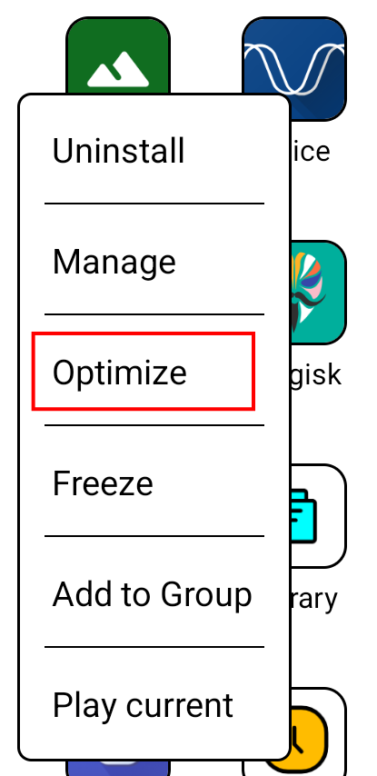

#### Option 2
- Open the app you want to configure

- Display `eInk Wise` overlay

- Tap small cogwheel next to selected eInkWise profile  
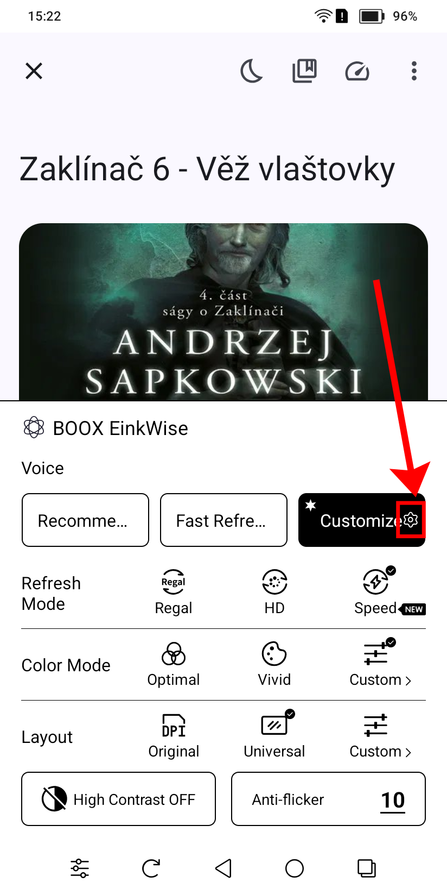


Both these options brings you to app profile in eInk Wise.

>[!WARNING]  
>Remember this setting is tied to specific profile for that app. If you change profile from `Customize` to `Recommended` or `Fast` settings including background running will be different (probably default => running in background disabled).  
>You have to customize settings for all profiles, or be sure that profile for that app never changes.

- In eInk Wise profile tap on `Others`  
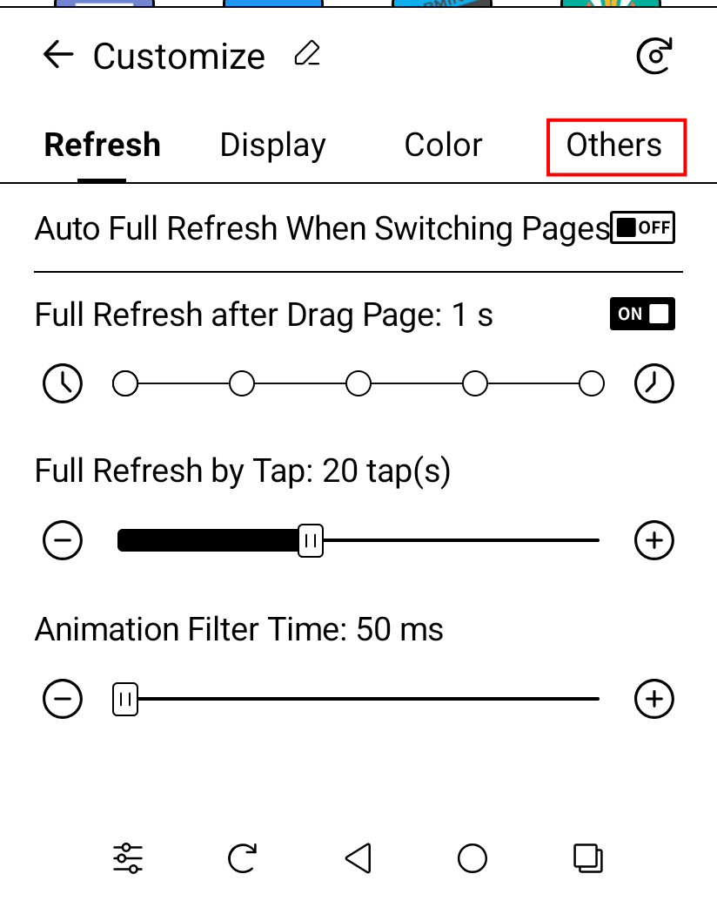

- On `Others` tab enable `Stay active in the background` option
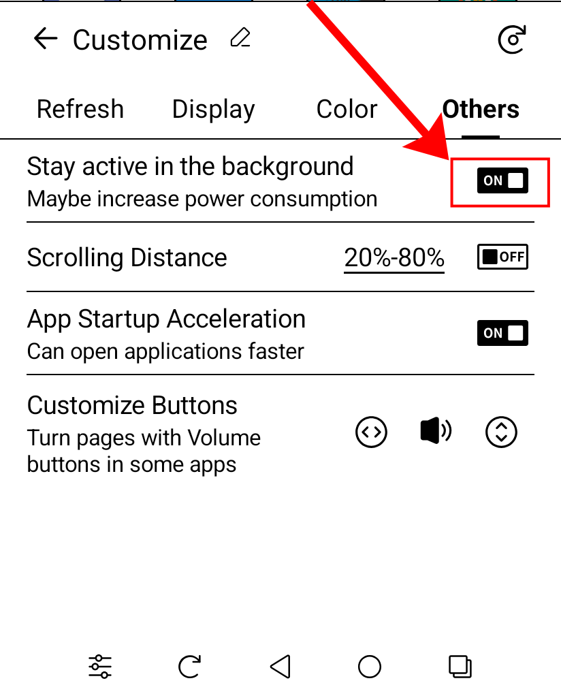

### Chapter 2 - Onyx Settings

Now let's disable `App freezing` and enable `Autostart` for our app.

- From Boox launcher or top tray select `Settings`  
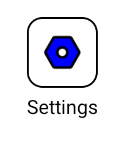

- In `Settings` menu select `Apps & Notifications`  
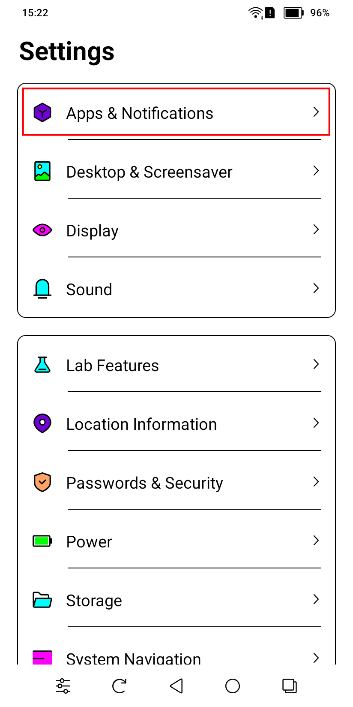

- Then select `Freeze Settings`  
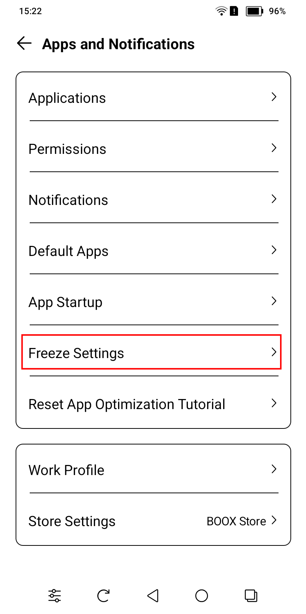

- Disable `Freezing` for selected app  


- Now return back to `Apps & Notifications` and select `App Startup`  
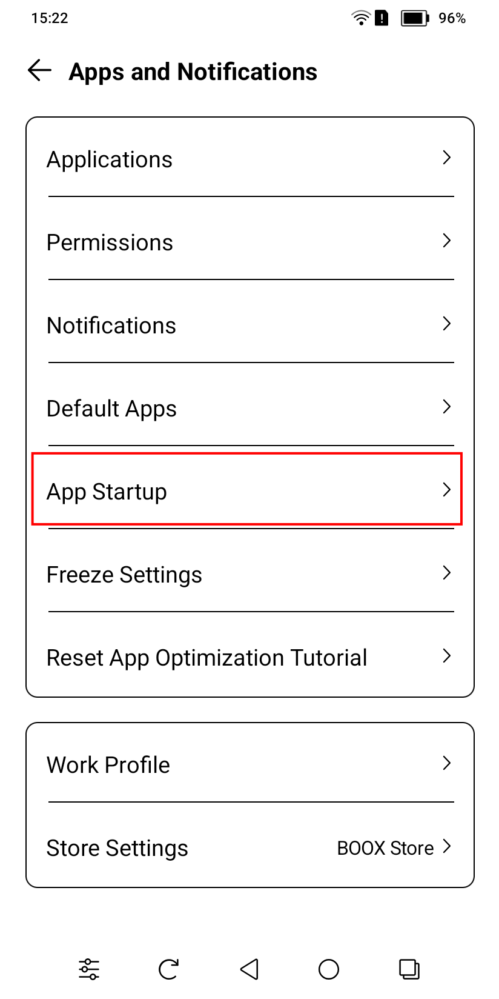

- And enable `Autostart` for selected app  


### Chapter 3 - Android Settings

Now for the more tricky part. You need to access standard `Android setting`. But those are unaccessible from Boox launcher.  
But since everyone played Dark Souls these days, this cannot stop anyone.  
Just install any other launcher of your choice (do not set it as default - it has a reason you will soon find out if you do).  
I will use `Nova Launcher` for example.

- Start launcher of your choice  
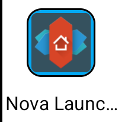

- Start `Settings` app from launcher (not from top tray!)  
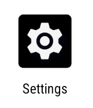

- This will bring you to `Android Settings` where you need to select `Apps`
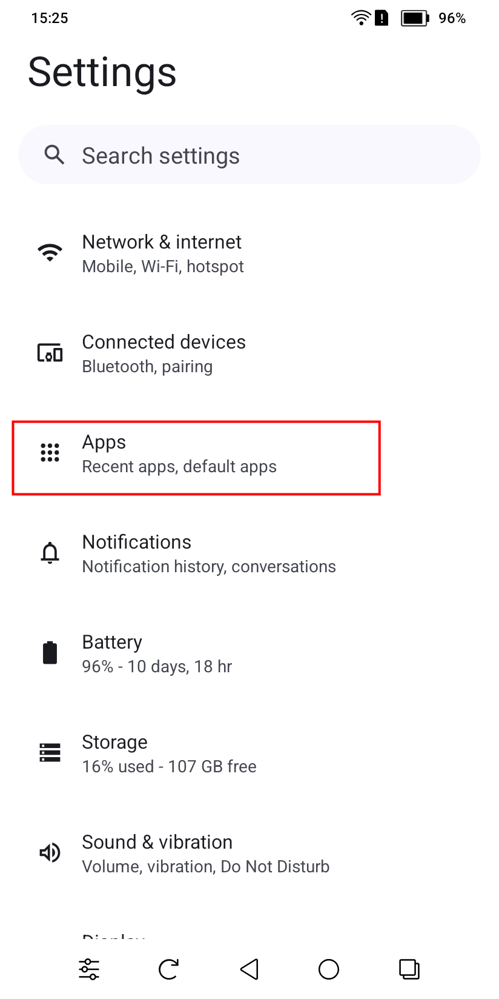

- Select app you need to allow to run in background
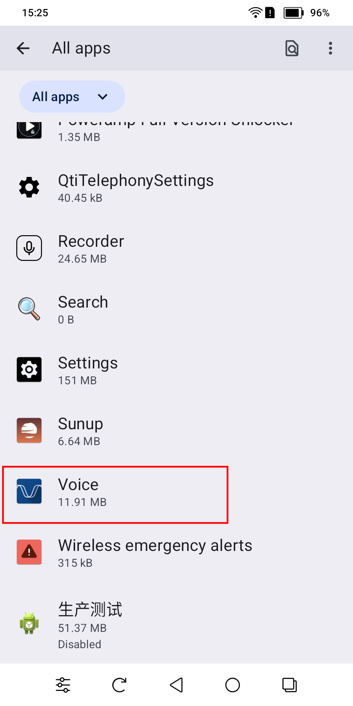

- On app settings page (I changed app name on purpose) scroll down  
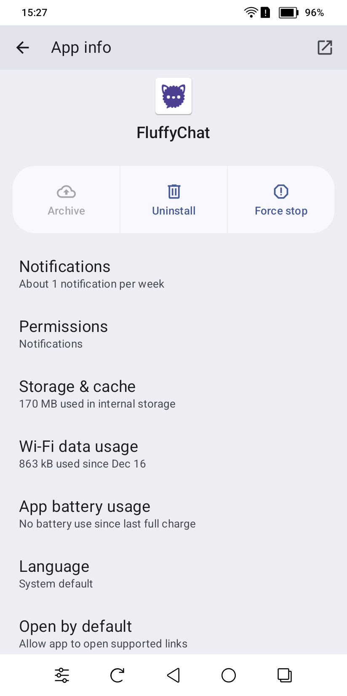

- Disable `Manage app if unused`


- Now scroll back up and enter `App battery usage` submenu
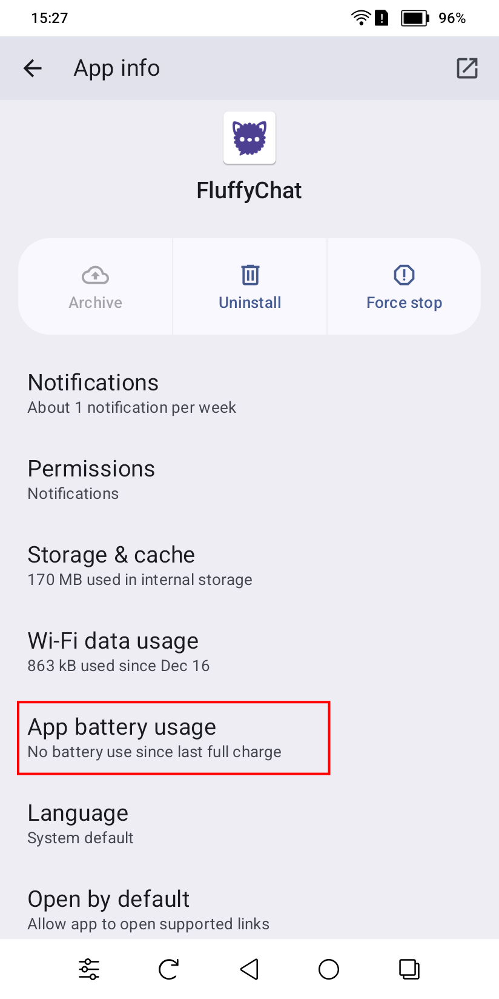

- Inside `App battery usage` submenu tap on `Allow background usage` text (box next to it should say enabled - this is done by eInkWise)  


- Clicking on text opens another menu where you need to set `Unrestricted` option  
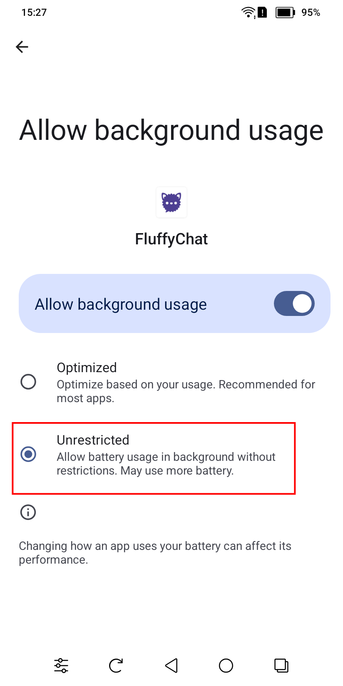

- Now return back to `App info` screen and select `Permissions`  
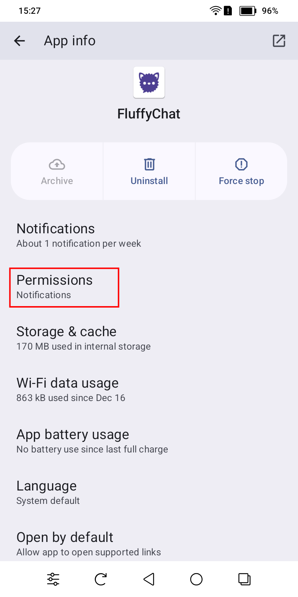

- Disable `Pause app activity if unused`
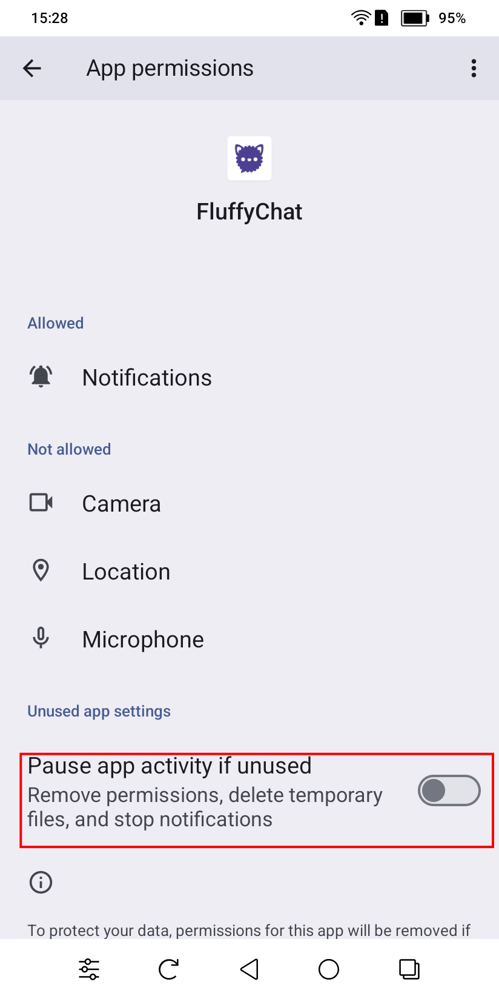

### Epilogue

:confetti_ball: :fireworks:  
If you reached this point, then congrats! You just enabled single app to run on background and not be killed by power management!

As you just witnessed, it is just easy and intuitive.  
Who needs some toggle button, when you have this beautiful UI designed by mad genius?!

## Enabling notifications for all apps

Since on Android some apps needs `Google Services` to show local notifications (why?) on the device and Palma 2 Pro does not have them, you must use another solution. Some info for example is [here](https://github.com/krille-chan/fluffychat/wiki/Push-Notifications-without-Google-Services)

For these purposes you can use [SunUp](https://unifiedpush.org/users/distributors/sunup/), [ntfy](https://unifiedpush.org/users/distributors/ntfy/), or some other implementation.  
I choosed SunUp because my favorite messaging app has some [weird bug](https://github.com/krille-chan/fluffychat/issues/1314#issuecomment-2336777629) with ntfy.

> [!NOTE]  
> You will need to enable notification app to [run in background](#enabling-app-to-run-in-background)

## How to restore Palma 2 Pro if not booting to Android

If you somehow bricked your Palma and have backup there is still hope!  
You are probably stuck with unresponsive device with BOOX logo on the screen.

- first connect device to computer and check if it is in fastboot mode with `fastboot getvar all`

- If you are able to get some output, get [edl](https://github.com/bkerler/edl) utility (which you probably already have)

- Leave device connected to computer and issue some `edl` command using correct loader. Example: `edl --loader=palma2pro.bin printgpt`

- Now pres and hold `Power button` on your Palma until device reboots - screen will flash

- Immediately release power button and press and hold VolUp + VolDown until you see device is recognized by computer. Then release buttons.

- Now you will be able to flash backup and restore device functionality

>[!WARNING]  
>For some reason I encountered behavior that even after restore Palma refused to boot. Setting active boot partition to secondary and then back was needed.
>Can be done this way:
>```
>edl --loader=palma2pro.bin setactiveslot a
>edl --loader=palma2pro.bin reset
>edl --loader=palma2pro.bin setactiveslot b
>edl --loader=palma2pro.bin reset
>```

## Rooting Palma 2 Pro - In progress

Any help appreciated. Let's discuss that on [MobileRead](https://www.mobileread.com/forums/showthread.php?t=371138)

## How to get into recovery menu

[source](https://drive.google.com/file/d/1Mu-mD0hE7L09MH52Oq13iGLPQM-NFXbB/view?pli=1)

- When turned off, long-press power button until screen blinks

- Release the power button and then press it again for 5 sec

- Release the power button and short-press 6 times

- If you end up with white screen, pres `Vol Down` once

